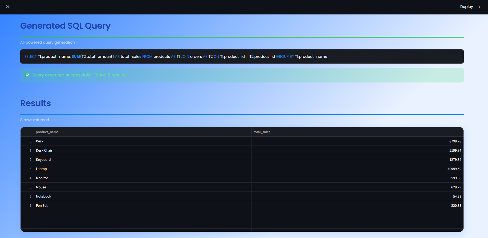
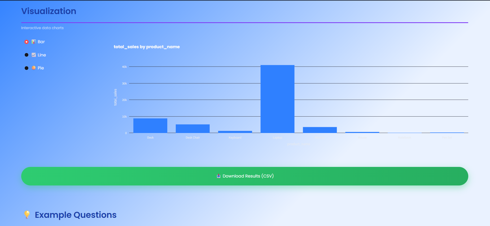
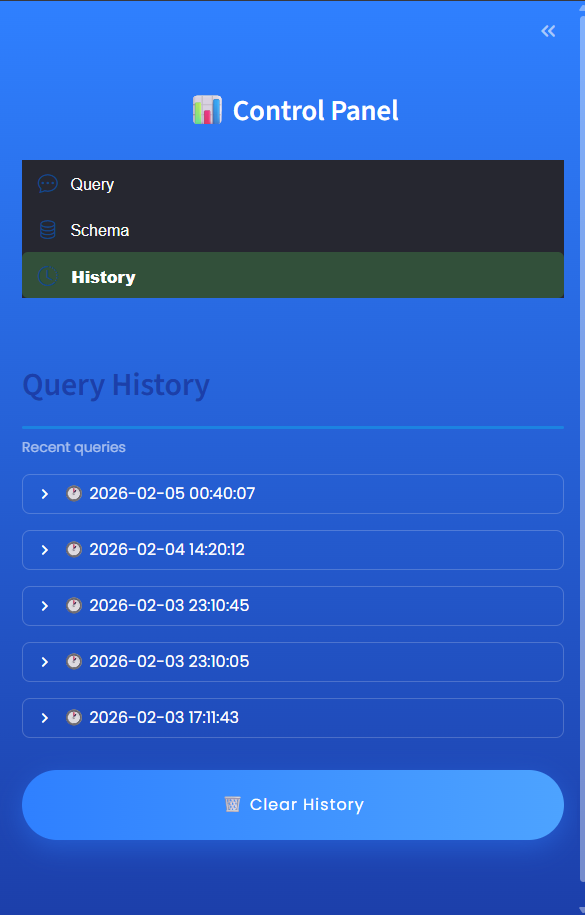

# 🤖 SQL AI Assistant


A powerful AI-powered SQL assistant that transforms natural language questions into SQL queries and executes them automatically. Built with Streamlit, LangChain, and Ollama for local LLM inference.


---

## ✨ **Features**

- 🗣️ **Natural Language to SQL**: Ask questions in plain English, get SQL queries instantly
- 🚀 **Automatic Execution**: Queries are executed automatically with results displayed
- 📊 **Interactive Visualizations**: Auto-generates charts (Bar, Line, Pie) from query results
- 📜 **Query History**: Tracks all your queries with timestamps and success status
- 🔍 **Schema Explorer**: View your database structure at a glance
- ⚡ **Query Optimization**: Get suggestions to improve query performance
- 💾 **Export Results**: Download query results as CSV files
- 🎨 **Beautiful UI**: Modern, responsive interface with gradient design
- 🔒 **100% Local**: Uses Ollama for privacy - no data leaves your machine

---

## 🛠️ **Tech Stack**

| Technology | Purpose |
|------------|---------|
| **Python 3.8+** | Backend language |
| **Streamlit** | Web interface framework |
| **Ollama** | Local LLM inference (Gemma 3 4B) |
| **LangChain** | LLM orchestration |
| **SQLite** | Database engine |
| **SQLAlchemy** | Database ORM |
| **Pandas** | Data manipulation |
| **Plotly** | Interactive visualizations |

---

## 📦 **Installation**

### **Prerequisites**

- Python 3.8 or higher
- Ollama installed ([Download here](https://ollama.ai))

### **Step 1: Clone the Repository**
```bash
git clone https://github.com/yourusername/sql-ai-assistant.git
cd sql-ai-assistant
```

### **Step 2: Create Virtual Environment**
```bash
# Windows
python -m venv .venv
.venv\Scripts\activate

# Mac/Linux
python3 -m venv .venv
source .venv/bin/activate
```

### **Step 3: Install Dependencies**
```bash
pip install -r requirements.txt
```

### **Step 4: Install Ollama Model**
```bash
# Download Gemma 3 4B model (recommended)
ollama pull gemma3:4b

# OR use Llama 3.2 (smaller, faster)
ollama pull llama3.2:3b
```

### **Step 5: Create Sample Database**
```bash
python create_sample_db.py
```

### **Step 6: Run the App**
```bash
streamlit run app.py
```

The app will open in your browser at `http://localhost:8501`

---

## 📂 **Project Structure**
```
sql-ai-assistant/
├── assets/
│   └── styles.css              # Custom CSS styling
├── .streamlit/
│   └── config.toml             # Streamlit theme configuration
├── data/
│   └── sample_sales.db         # Sample SQLite database
├── query_logs/
│   └── history.json            # Query history storage
├── app.py                      # Main Streamlit application
├── database.py                 # Database connection & operations
├── query_generator.py          # LLM-powered SQL generation
├── query_history.py            # Query history management
├── utils.py                    # Utility functions (CSS loader)
├── create_sample_db.py         # Database creation script
├── requirements.txt            # Python dependencies
└── README.md                   # Project documentation
```

---

## 🚀 **Usage**

### **1. Ask Questions in Natural Language**

Simply type your question in the input box:
```
"Show me total sales for each product"
"Which customers spent the most money?"
"What are the top 3 selling products?"
```

### **2. View Generated SQL**

The AI automatically generates optimized SQL queries:
```sql
SELECT p.product_name, SUM(o.total_amount) as total_sales
FROM products p
JOIN orders o ON p.product_id = o.product_id
GROUP BY p.product_name
ORDER BY total_sales DESC;
```

### **3. See Results & Visualizations**

- Results displayed in interactive tables
- Auto-generated charts (Bar/Line/Pie)
- Download results as CSV

### **4. Track Your History**

All queries are saved with:
- Timestamp
- Question asked
- SQL generated
- Success/Error status
- Number of results

---

## 💡 **Example Questions**

Try these sample queries:

- **Sales Analysis**
  - "Show me total sales by product category"
  - "What's the average order value?"
  - "Which products sold the most last month?"

- **Customer Insights**
  - "Who are my top 5 customers by spending?"
  - "Which country has the most customers?"
  - "Show me customer distribution by city"

- **Product Performance**
  - "What are the top 3 selling products?"
  - "Which product category generates the most revenue?"
  - "Show me products that sold less than 10 units"

---

## 👤 **Author**

**Your Name**
- GitHub: [@Salma-karima](https://github.com/salmakarima)
- LinkedIn: [Salma karima](https://www.linkedin.com/in/salma-karima)
- Email: krima.salma01@gmail.com

## 🙏 **Acknowledgments**

- [Streamlit](https://streamlit.io/) - Amazing framework for data apps
- [Ollama](https://ollama.ai/) - Local LLM inference
- [LangChain](https://langchain.com/) - LLM orchestration
- [Plotly](https://plotly.com/) - Interactive visualizations

---

## 📸 **Screenshots**

### Main Interface


### Query Results


### Visualizations


### Query History


---

## ⭐ **Star This Project**

If you find this project helpful, please give it a ⭐ on GitHub!


